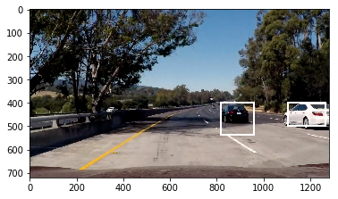

# Vehicle Detection

My submission for term 1 project 5, see [vehicle_detection.ipynb](./vehicle_detection.ipynb) for implementation and [writeup.md](./writeup.md) for details.

## Overview

In this project, your goal is to write a software pipeline to detect vehicles in a video.

